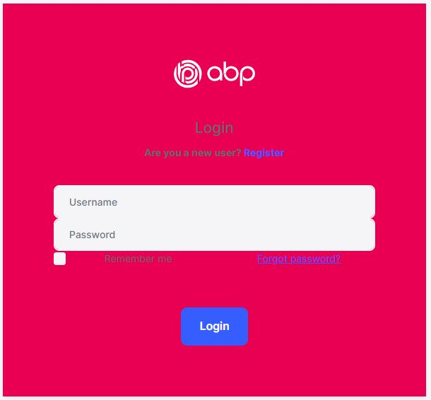

## How to customize the login page of an ABP blazor application


## Introduction

In this article, I will show you how to customize the login page of a **Blazor APB application**

The sample application in this **GitHub** repository has been developed with **Blazor** as UI framework and **SQL Server** as database provider.

### Source Code

Source code of the completed application is [available on GitHub](https://github.com/bartvanhoey/AbpBlazorCustomizeLoginPage).

## Requirements

The following tools are needed to be able to run the solution.

* .NET 5.0 SDK
* VsCode, Visual Studio 2019 16.8.0+ or another compatible IDE

## Development

### Creating a new Application

* Install or update the ABP CLI:

```bash
dotnet tool install -g Volo.Abp.Cli || dotnet tool update -g Volo.Abp.Cli
```

* Use the following ABP CLI command to create a new Blazor ABP application:

```bash
abp new AbpBlazorCustomizeLoginPage -u blazor
```

### Open & Run the Application

* Open the solution in Visual Studio (or your favorite IDE).
* Run the `AbpBlazorCustomizeLoginPage.DbMigrator` application to apply the migrations and seed the initial data.
* Run the `AbpBlazorCustomizeLoginPage.HttpApi.Host` application to start the server side.
* Run the `AbpBlazorCustomizeLoginPage.Blazor` application to start the Blazor UI project.

## Create a CustomLoginModel

* Create a folder structure **Pages/Account** in the **HttpApi.Host** project of your application.
* Add a **CustomLoginModel.cs** class to the **Account** folder.

```csharp
using Microsoft.AspNetCore.Authentication;
using Microsoft.AspNetCore.Identity;
using Microsoft.Extensions.Options;
using Volo.Abp.Account.Web;
using Volo.Abp.Account.Web.Pages.Account;

namespace AbpBlazorCustomizeLoginPage.HttpApi.Host.Pages.Account
{
  public class CustomLoginModel : LoginModel
  {
    public CustomLoginModel(IAuthenticationSchemeProvider schemeProvider, IOptions<AbpAccountOptions> accountOptions, IOptions<IdentityOptions> identityOptions)
        : base(schemeProvider, accountOptions, identityOptions) { }
  }
}
```

* Add a **Login.cshtml** file to the **Account** folder.

```html
@page
@addTagHelper *, Microsoft.AspNetCore.Mvc.TagHelpers
@addTagHelper *, Volo.Abp.AspNetCore.Mvc.UI
@addTagHelper *, Volo.Abp.AspNetCore.Mvc.UI.Bootstrap
@addTagHelper *, Volo.Abp.AspNetCore.Mvc.UI.Bundling

@using Microsoft.AspNetCore.Mvc.Localization
@using Volo.Abp.Account.Localization
@using Volo.Abp.Account.Settings
@using Volo.Abp.Settings

@model AbpBlazorCustomizeLoginPage.HttpApi.Host.Pages.Account.CustomLoginModel

@inject IHtmlLocalizer<AccountResource> L
@inject Volo.Abp.Settings.ISettingProvider SettingProvider

<div class="card text-center mt-3 shadow-sm rounded">
    <div class="card-body abp-background p-5">
        
        <h4>@L["Login"]</h4>
        @if (await SettingProvider.IsTrueAsync(AccountSettingNames.IsSelfRegistrationEnabled))
        {
            <strong>
                @L["AreYouANewUser"]
                <a href="@Url.Page("./Register", new {returnUrl = Model.ReturnUrl, returnUrlHash = Model.ReturnUrlHash})" class="text-decoration-none">@L["Register"]</a>
            </strong>
        }
        @if (Model.EnableLocalLogin)
        {
            <form method="post" class="mt-4 text-left">
                <input asp-for="ReturnUrl" />
                <input asp-for="ReturnUrlHash" />
                <div class="form-group">
                    @*<label asp-for="LoginInput.UserNameOrEmailAddress"></label>*@
                    <label>Username</label>
                    <input asp-for="LoginInput.UserNameOrEmailAddress" class="form-control" />
                    <span asp-validation-for="LoginInput.UserNameOrEmailAddress" class="text-danger"></span>
                </div>
                <div class="form-group">
                    <label asp-for="LoginInput.Password"></label>
                    <input asp-for="LoginInput.Password" class="form-control" />
                    <span asp-validation-for="LoginInput.Password" class="text-danger"></span>
                </div>
                <abp-row>
                    <abp-column>
                        <abp-input asp-for="LoginInput.RememberMe" class="mb-4" />
                    </abp-column>
                    <abp-column class="text-right">
                        <a href="@Url.Page("./ForgotPassword", new {returnUrl = Model.ReturnUrl, returnUrlHash = Model.ReturnUrlHash})">@L["ForgotPassword"]</a>
                    </abp-column>
                </abp-row>
                <abp-button type="submit" button-type="Primary" name="Action" value="Login" class="btn-block btn-lg mt-3">@L["Login"]</abp-button>
                @if (Model.ShowCancelButton)
                {
                    <abp-button type="submit" button-type="Secondary" formnovalidate="formnovalidate" name="Action" value="Cancel" class="btn-block btn-lg mt-3">@L["Cancel"]</abp-button>
                }
            </form>
        }
        @if (Model.VisibleExternalProviders.Any())
        {
            <div class="mt-2">
                <h5>@L["OrLoginWith"]</h5>
                <form asp-page="./Login" asp-page-handler="ExternalLogin" asp-route-returnUrl="@Model.ReturnUrl" asp-route-returnUrlHash="@Model.ReturnUrlHash" method="post">
                    <input asp-for="ReturnUrl" />
                    <input asp-for="ReturnUrlHash" />
                    @foreach (var provider in Model.VisibleExternalProviders)
                    {
                        <button type="submit" class="btn btn-primary m-1" name="provider" value="@provider.AuthenticationScheme" title="@L["GivenTenantIsNotAvailable", provider.DisplayName]">@provider.DisplayName</button>
                    }
                </form>
            </div>
        }
        @if (!Model.EnableLocalLogin && !Model.VisibleExternalProviders.Any())
        {
            <div class="alert alert-warning">
                <strong>@L["InvalidLoginRequest"]</strong>
                @L["ThereAreNoLoginSchemesConfiguredForThisClient"]
            </div>
        }
    </div>
</div>
```

## Add some custom styles and image to the HttpApi.Host project

* add a file **login.css** to the **wwwroot** folder of the **HttpApi.Host** project.

```css
.abp-background {
    background-color:  #e90052 !important;
}
```

* Open file **AbpBlazorCustomizeLoginPageHttpApiHostModule.cs** and update **ConfigureBundles()** method.

```csharp
 private void ConfigureBundles()
    {
      Configure<AbpBundlingOptions>(options =>
      {
        options.StyleBundles.Configure(
                  BasicThemeBundles.Styles.Global,
                  bundle =>
              {
                bundle.AddFiles("/global-styles.css");
                bundle.AddFiles("/login.css");
              }
              );
      });
    }
```

* add an **assets/images** folder to the **wwwroot** folder of the **HttpApi.Host** project and copy/paste the **abp logo** in the **images** folder.  You can find a copy of the logo [here](https://github.com/bartvanhoey/AbpBlazorCustomizeLoginPage/blob/gh-pages/src/AbpBlazorCustomizeLoginPage.Blazor/wwwroot/assets/abp-logo-light.svg).

## Start both the Blazor and the HttpApi.Host project to run the application

Et voilà! This is the result.



You can now modify the login page, add your custom styles, or custom images, etc.

Find more about ASP.NET Core (MVC/Razor Pages) User Interface Customization Guide [here](https://docs.abp.io/en/abp/4.1/UI/AspNetCore/Customization-User-Interface).

Get the [source code](https://github.com/bartvanhoey/AbpBlazorCustomizeLoginPage) on GitHub.

Enjoy and have fun!
